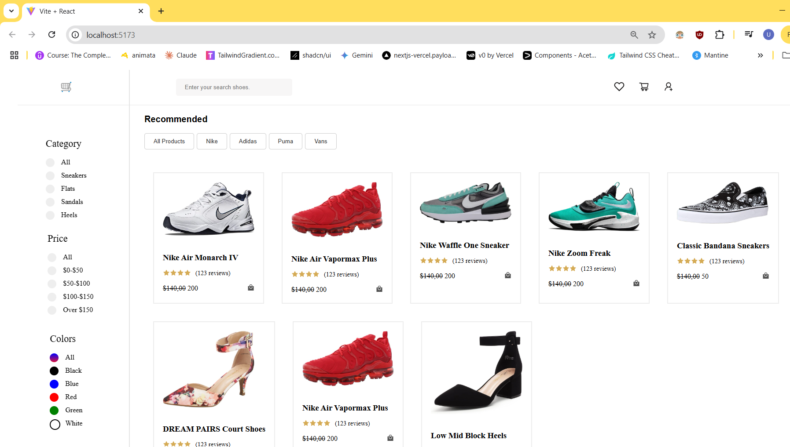

# React Filters Dashboard

## Overview
The React Filters Dashboard is a user-friendly web app for filtering and viewing products. It offers an intuitive interface for applying various filters, enabling efficient data exploration and visualization. It lets you search by brand, category, price, and color, updating results instantly for a seamless browsing experience.

## Features
- **Button Component**: Recommended Filters According to Brands (Nike, Adidas, Puma, Vans)  
- **Card Component**: To display details (img, title, star, reviews, prevPrice, newPrice) of All Products
- **SideBar**: Apply Filter by Category, Price, and Colors
- **Search Bar**: handler When user pass input to searchbar, This field Iterating all the characters that user is typing in search field



## Tech Stack
- React
- Vite
- React Icons
- CSS3
- Node.js
- npm

## Project Structure
```
React-Filters-Dashboard/
├── src/
│   ├── components/
│   │   ├── Button.jsx
│   │   ├── Card.jsx
│   │   └── Input.jsx
│   ├── Navigation/
│   ├── Products/
│   ├── Recommended/
│   ├── Sidebar/
│   └── db/
│       └── data.jsx
├── package.json
└── vite.config.js
```

## Installation
To get started with the React Filters Dashboard, follow these steps:

1. Clone the repository:
```bash
git clone https://github.com/Umanpatel/React-Filters-Dashboard.git
```

2. Navigate to the project directory:
```bash
cd React-Filters-Dashboard
```

3. Install the dependencies:
```bash
npm install
```

## Development
To start the development server:
```bash
npm run dev
```